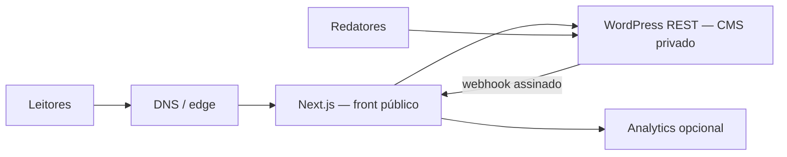

# Deploy, DNS e rollback

## Arquitetura de produção



O alvo preferencial é Vercel para o Next.js e a hospedagem atual para o WordPress. Um servidor Node.js 22 também suporta todos os recursos; exportação estática não serve porque preview, busca e revalidação usam runtime.

## Estratégia de domínio

1. Baixe o TTL de `promogamesbr.com` e `www` para 300 segundos pelo menos 24 horas antes.
2. Crie `cms.promogamesbr.com` apontando para a origem WordPress, com HTTPS e autenticação forte no painel.
3. Garanta que REST, Application Passwords e uploads funcionem nesse host.
4. Configure `WORDPRESS_API_URL=https://cms.promogamesbr.com/wp-json/wp/v2` no front.
5. Preserve mídia com uma destas opções:
   - manter `/wp-content/uploads/*` em proxy para a origem WordPress; ou
   - reescrever URLs para `cms.promogamesbr.com`/CDN. O Next já aceita os dois hosts.
6. Depois do staging aprovado, aponte o domínio público ao Next.js.

Se o WordPress precisar continuar no domínio principal durante a transição, o edge deve enviar `/wp-json/*`, `/wp-admin/*`, `/wp-login.php` e `/wp-content/uploads/*` à origem WordPress e todo o restante ao Next.js.

## Deploy de staging

1. Crie o projeto do front com diretório raiz `web` e Node.js 22.
2. Cadastre todas as variáveis de [web/.env.example](../web/.env.example). Use segredos diferentes entre preview e produção.
3. Rode `npm ci`, `npm run check` e `npm run test:e2e` no build/CI.
4. Publique em `novo.promogamesbr.com`.
5. Copie `wordpress/promogames-core` para `wp-content/plugins/`, ative o plugin e configure no `wp-config.php`:

```php
define('PROMOGAMES_FRONTEND_URL', 'https://novo.promogamesbr.com');
define('PROMOGAMES_PREVIEW_SECRET', 'mesmo-valor-de-DRAFT_MODE_SECRET');
define('PROMOGAMES_REVALIDATE_URL', 'https://novo.promogamesbr.com/api/revalidate/');
define('PROMOGAMES_REVALIDATE_SECRET', 'mesmo-valor-de-REVALIDATE_SECRET');
```

6. Crie um usuário técnico somente com a capacidade necessária e uma Application Password exclusiva.
7. Execute `npm run verify:production -- https://novo.promogamesbr.com` e o checklist de QA.

## Cutover

- Faça backup do banco e de `wp-content`.
- Congele mudanças de infraestrutura, não a publicação editorial.
- Confirme que `main` e a release implantada apontam para o mesmo commit.
- Troque DNS/proxy, valide HTTPS e rode o smoke test.
- Publique uma matéria de teste, confirme o webhook e remova-a.
- Valide GA em tempo real somente se `NEXT_PUBLIC_GA_MEASUREMENT_ID` estiver configurado.
- Monitore por pelo menos 60 minutos: erros 5xx, latência do WordPress, taxa de 404, imagens e Core Web Vitals.

## Observabilidade

- Logs do runtime: falhas da API WordPress e eventos de revalidação usam prefixo `[wordpress]`/`[promogames]`.
- Disponibilidade: monitore `/`, `/sitemap.xml` e uma matéria real a cada 5 minutos.
- Conteúdo: alerte para erro 5xx do `/wp-json/wp/v2/posts` e para webhooks 401/5xx.
- Produto: GA é carregado apenas quando a variável pública existe; acompanhe page views e eventos sem misturar staging.
- SEO: acompanhe cobertura e 404 no Search Console após o cutover.

## Rollback

Meta operacional: decidir em 5 minutos e restaurar o front anterior em até 15 minutos.

1. Promova o deployment anterior do Next.js ou reverta o DNS/proxy para o WordPress legado.
2. Restaure as regras antigas de `/wp-content` e `/wp-json` se foram alteradas.
3. O conteúdo não precisa ser restaurado: o WordPress permaneceu como fonte de verdade durante todo o processo.
4. Se a integração causar o incidente, desative **PromoGames Core**; os metadados ficam preservados no banco.
5. Rode smoke test no front restaurado e comunique o status.
6. Só refaça o cutover após causa raiz, correção testada e nova release.

Nunca faça rollback apagando banco, uploads ou commits. DNS deve ser o último recurso; prefira promover o deployment anterior porque é mais rápido e previsível.
