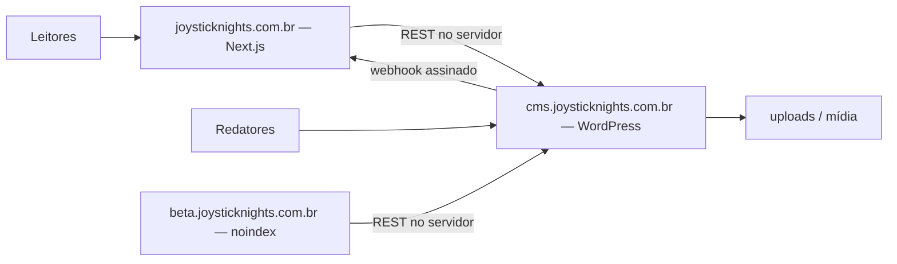

# Piloto headless do JoystickNights

Runbook de restauração, beta, cutover e rollback de `joysticknights.com.br`. O objetivo é provar o procedimento completo antes de repeti-lo no PromoGames, mantendo WordPress como fonte de verdade editorial e trocando apenas a camada pública.

**Estado auditado:** 26 de julho de 2026

**Perfil do frontend:** `joysticknights`

**Domínio público final:** `https://joysticknights.com.br`

**CMS proposto:** `https://cms.joysticknights.com.br`
**Beta proposto:** `https://beta.joysticknights.com.br`

## Regras de segurança

- Não alterar o WordPress público existente durante a preparação do beta.
- Não usar o dump antigo que está dentro do TAR como fonte do ensaio.
- Fazer um backup novo imediatamente antes do cutover; o snapshot do repositório não substitui o backup final.
- Não versionar SQL, uploads, `wp-config.php`, `.env`, Application Passwords, salts ou segredos.
- Manter beta com `NEXT_PUBLIC_INDEXING_ENABLED=false` até o corte.
- Nunca executar search/replace textual diretamente no SQL; usar WP-CLI com `--precise` e primeiro `--dry-run`.
- Rollback não restaura banco antigo: ele volta o tráfego ao WordPress usando o banco mais recente.

## Topologia escolhida



O host `cms` deve apontar para a instalação WordPress restaurada na hospedagem atual. O domínio público aponta para o frontend somente depois do QA. O frontend consulta `cms` diretamente no servidor; não depende de CORS para as leituras normais.

`WORDPRESS_API_URL` precisa terminar em `/wp-json/wp/v2`. Quando seu origin é diferente de `NEXT_PUBLIC_SITE_URL`, o `next.config.ts` deriva o origin do CMS dessa variável e cria automaticamente:

- rewrites de `/wp-content/*`, `/wp-includes/*` e `/wp-json/*` para o CMS;
- redirects temporários de `/wp-admin`, `/wp-admin/*` e `/wp-login.php` para o CMS;
- permissão do host do CMS para imagens, CSP e conexões necessárias.

Assim, uma URL legada como `https://joysticknights.com.br/wp-content/uploads/...` continua chegando ao arquivo no CMS, e `/wp-json/...` permanece compatível no domínio público. O painel é redirecionado em vez de proxied, preservando o origin esperado por login e cookies. Essas regras são geradas na build; mudar `WORDPRESS_API_URL` exige novo deploy.

No DNS/edge ainda é necessário manter:

- acesso direto a `cms.joysticknights.com.br/wp-admin/`, `/wp-login.php` e `/wp-json/`;
- redirect 301 de `www.joysticknights.com.br` para o domínio sem `www`;
- header `X-Robots-Tag: noindex, nofollow` para respostas HTML do host `cms`, sem bloquear REST, login ou uploads necessários.

Não exponha o diretório do CMS por Basic Auth global se isso impedir o frontend de consultar o REST. Proteja o painel com HTTPS, senha forte, MFA quando disponível e controles específicos para `/wp-admin`.

## Fonte auditada e escolha do backup

Arquivos disponíveis localmente:

| Artefato | Estado | Uso |
|---|---|---|
| `arquivoswordpress/JoysticKnights/u725215668.joysticknights-com-br.20260723212510.tar` | snapshot de arquivos de 23/07/2026 | restauração de `public_html` e `wp-content` |
| `arquivoswordpress/JoysticKnights/u725215668_9spGP.sql` | dump MariaDB concluído em 23/07/2026 | base correta do ensaio local |
| `arquivoswordpress/JoysticKnights/u725215668_9spGP.joysticknights-com-br.20260723212510.sql.gz` | cópia comprimida idêntica ao SQL acima | transporte/arquivo |
| `public_html/backup.sql` dentro do TAR | dump de 20/12/2025, com URL `http://www...` e plugins diferentes | **não usar** |

O SQL correto possui aproximadamente 28 MB, 131 tabelas e aponta para `https://joysticknights.com.br`. O TAR possui aproximadamente 3,56 GB, incluindo 1,61 GB de uploads e um ZIP legado de aproximadamente 1,59 GB. Verifique espaço livre antes de extrair.

Antes de usar os arquivos, registre integridade sem publicar os hashes em locais desnecessários:

```powershell
Get-FileHash -Algorithm SHA256 '.\arquivoswordpress\JoysticKnights\u725215668_9spGP.sql'
Get-FileHash -Algorithm SHA256 '.\arquivoswordpress\JoysticKnights\u725215668.joysticknights-com-br.20260723212510.tar'
Get-Item '.\arquivoswordpress\JoysticKnights\u725215668_9spGP.sql', '.\arquivoswordpress\JoysticKnights\u725215668.joysticknights-com-br.20260723212510.tar' | Select-Object FullName, Length, LastWriteTime
```

No cutover real, repita o inventário com um dump e uma cópia de uploads gerados naquele momento.

## Estado funcional que deve ser preservado

O snapshot atual usa WordPress 7.0.2, tema Hello Elementor 3.4.9 e estes plugins ativos:

- The SEO Framework 5.1.4;
- Complianz 7.5.0;
- Elementor e Elementor Pro 4.2.0;
- Site Kit by Google 1.183.0;
- LiteSpeed Cache 7.8.1, incluindo o drop-in de object cache;
- Spectra Legacy 2.20.0;
- WP-PageNavi 2.94.5;
- MU plugins de atualização e preview da Hostinger.

WPCode Lite e Royal Elementor Addons existem no disco, mas estão inativos. Não ativá-los apenas porque estão presentes. A base também contém tabelas e CPTs órfãos de plugins removidos; não reinstalar plugins históricos sem necessidade confirmada.

Conteúdo a conferir depois da restauração:

- 107 posts publicados e 23 rascunhos;
- 7 páginas publicadas e 1 rascunho;
- home WordPress `Início` (ID 2286) e página de posts `Postagens` (ID 2292);
- 106 posts com imagem destacada;
- 18 posts com blocos Spectra;
- comentários abertos, com 4 comentários aprovados no snapshot;
- permalink WordPress `/%category%/%postname%`.

Esses números são baseline do snapshot, não meta do cutover. O backup fresco deve ser comparado com a produção no dia da migração.

## Responsabilidade dos plugins no headless

| Componente atual | Fica no WordPress | Substituição ou integração no frontend |
|---|---|---|
| Gutenberg | Sim, editor principal | Renderizar `content.rendered` sanitizado e estilos compatíveis |
| Spectra | Sim, por causa de 18 posts | Reproduzir CSS necessário aos blocos; scripts do plugin não aparecem automaticamente |
| Elementor/Pro | Sim durante estabilização e rollback | Next.js substitui o tema; páginas Elementor exigem rota própria, adaptação ou redirect |
| The SEO Framework | Sim, como interface editorial | `promogames_seo` já alimenta os mappers e metadata; Next gera canonical, Open Graph, JSON-LD, sitemap e robots |
| Complianz | Manter configuração até concluir auditoria | Banner e estado de consentimento são implementados no Next; `wp_head` não é executado |
| Site Kit | Manter histórico/configuração | Tag Google é carregada no Next somente após consentimento |
| LiteSpeed Cache | Pode continuar para object cache e mídia | Cache de página do Next/provedor e revalidação substituem a cache do tema WordPress |
| WP-PageNavi | Manter apenas para rollback do tema | Paginação pública é responsabilidade do Next |
| MU plugins Hostinger | Manter e monitorar | Nenhuma UI pública deve depender deles |
| PromoGames Core 1.1 | Instalar no CMS | Contrato editorial, SEO TSF/SEOPress, comentários assinados, preview e revalidação |

Também precisam ser preservados ou substituídos conscientemente:

- `ads.txt` da raiz;
- arquivo de verificação Google da raiz;
- analytics e anúncios após consentimento;
- links internos, categorias e URLs antigas;
- formulários ou integrações descobertas no QA;
- moderação e envio de comentários.

## Fase 1 — preparar DNS e infraestrutura

1. Exporte a zona DNS atual e registre os targets existentes.
2. Pelo menos 24 horas antes do corte, reduza o TTL do domínio raiz e `www` para 300 segundos.
3. Crie `cms.joysticknights.com.br` apontando para a origem WordPress restaurada.
4. Crie `beta.joysticknights.com.br` no provedor do frontend.
5. Emita e valide HTTPS nos dois hosts antes de configurar WordPress ou Next.js.
6. Ative proteção de acesso no beta e mantenha `noindex`; conceda acesso aos revisores e ao fluxo de preview.
7. Confirme que o provedor executa os rewrites e redirects do Next derivados de `WORDPRESS_API_URL`. Mantenha uma regra equivalente no edge apenas como fallback documentado, sem duplicar roteamento durante a operação normal.

Se a hospedagem não permitir um host `cms` apontando com segurança para a mesma instalação, restaure uma cópia isolada. No dia do corte, faça sincronização final de banco e uploads sob pausa editorial. Depois do corte, todo o conteúdo deve ser escrito somente no CMS definitivo.

### Implantação específica na Hostinger

Use **Node.js Web App**, não “site PHP/HTML” nem exportação estática. Este frontend usa SSR/ISR, rotas de API, preview, comentários e revalidação; portanto, precisa do runtime Next.js. Em julho de 2026, a Hostinger oferece esse runtime gerenciado nos planos Business Web Hosting e Cloud. VPS também funciona, mas exige administração manual.

Para o primeiro beta, o caminho mais seguro no hPanel é:

1. Abra **Websites → Add Website → Deploy Web App**.
2. Crie a aplicação primeiro no domínio temporário oferecido pela Hostinger.
3. Selecione **Next.js** e **Node.js 22**.
4. Prefira GitHub para redeploy automático. Se o repositório continuar com o app dentro de `web/`, confirme que o hPanel permite definir `web` como raiz. Caso não permita, publique `web` em um repositório próprio ou envie um ZIP cujo `package.json` esteja diretamente na raiz do arquivo, nunca dentro de uma pasta `web/`.
5. Não inclua `.env.local`, `.next`, `node_modules`, backups, SQL ou uploads do WordPress no repositório/ZIP.
6. Confirme os comandos detectados: instalação `npm ci`, build `npm run build` e início `npm run start`. A saída é `.next`; não transforme o projeto em `next export`.
7. Cadastre as variáveis da seção “Fase 3” no hPanel. Segredos não entram no GitHub. Qualquer mudança de variável exige rebuild/redeploy.
8. Depois do primeiro deploy, conecte `beta.joysticknights.com.br` em **Connect domain**. Aguarde DNS e SSL automáticos antes do QA.

Não remova ainda o website WordPress que hoje usa o domínio principal. A Hostinger exige que uma aplicação Node seja adicionada como website separado e orienta remover o website já vinculado antes de reutilizar o mesmo domínio. Essa remoção pode apagar deployment, arquivos, bancos e configuração associada. Portanto, o domínio raiz só deve ser transferido depois que:

- o WordPress definitivo estiver restaurado e testado em `cms.joysticknights.com.br` como website separado;
- houver backup fresco baixado para fora da Hostinger;
- e-mail e outros serviços ligados ao website antigo estiverem inventariados;
- o beta estiver aprovado e o rollback ensaiado.

No corte, faça a pausa editorial e a sincronização final antes de remover/desassociar o website antigo no hPanel. Em seguida, conecte `joysticknights.com.br` à aplicação Node, confirme SSL, DNS e todos os testes da Fase 5. A propagação pode levar até 24 horas, embora o TTL reduzido normalmente encurte a troca.

Se o plano atual não mostrar **Deploy Web App**, ele não oferece o runtime necessário. Nesse caso, escolha entre upgrade para Business/Cloud, VPS administrado ou manter o WordPress na Hostinger e hospedar somente o Next.js em outro provedor compatível. Não tente resolver com um ZIP em `public_html`: isso serviria apenas arquivos estáticos e quebraria preview, comentários e revalidação.

## Fase 2 — restaurar o CMS

1. Crie banco e usuário exclusivos para o CMS. Não reutilize credenciais do dump ou de outro projeto.
2. Extraia o TAR em diretório isolado e mova apenas o `public_html` auditado para o document root do host `cms`.
3. Importe `u725215668_9spGP.sql`, nunca o `backup.sql` interno.
4. Crie um `wp-config.php` próprio para o ambiente, preservando o prefixo de tabelas e usando as novas credenciais.
5. Antes de trocar URLs, confirme o resultado de cada dry-run:

```bash
wp search-replace 'https://joysticknights.com.br' 'https://cms.joysticknights.com.br' --all-tables-with-prefix --precise --dry-run
wp search-replace 'https://www.joysticknights.com.br' 'https://cms.joysticknights.com.br' --all-tables-with-prefix --precise --dry-run
wp search-replace 'http://www.joysticknights.com.br' 'https://cms.joysticknights.com.br' --all-tables-with-prefix --precise --dry-run
```

6. Faça snapshot do banco restaurado. Só então repita sem `--dry-run`, apenas para origens que realmente tiveram ocorrências esperadas.
7. Fixe as opções e renove regras/cache:

```bash
wp option update siteurl 'https://cms.joysticknights.com.br'
wp option update home 'https://cms.joysticknights.com.br'
wp rewrite structure '/%category%/%postname%'
wp rewrite flush --hard
wp cache flush
```

8. Não faça replace indiscriminado de `joysticknights.com.br` sem protocolo: isso pode alterar e-mails ou outros dados legítimos.
9. Entre no painel, salve novamente os permalinks e abra posts antigos, recentes, páginas Elementor e mídia.
10. Confirme que nenhum e-mail, campanha, webhook comercial ou analytics de produção dispara durante o ensaio. Use bloqueio de saída/sandbox no ambiente, não credenciais falsas versionadas.

Validação básica do CMS:

```bash
wp core version
wp plugin list --status=active
wp theme list --status=active
wp option get siteurl
wp option get home
wp post list --post_type=post --post_status=publish --format=count
wp post list --post_type=page --post_status=publish --format=count
```

## Fase 3 — instalar o adaptador e configurar o beta

1. Copie `wordpress/promogames-core` para `wp-content/plugins/promogames-core`.
2. Ative a versão 1.1 e aplique as constantes de beta descritas no [README do plugin](../wordpress/promogames-core/README.md).
3. Crie um usuário técnico sem privilégios administrativos e uma Application Password exclusiva.
4. Confirme que nenhum plugin desabilita Application Passwords.
5. Cadastre no provedor do beta:

```dotenv
NEXT_PUBLIC_SITE_PROFILE=joysticknights
NEXT_PUBLIC_SITE_URL=https://beta.joysticknights.com.br
NEXT_PUBLIC_INDEXING_ENABLED=false
WORDPRESS_API_URL=https://cms.joysticknights.com.br/wp-json/wp/v2
WORDPRESS_USERNAME=<segredo-do-provedor>
WORDPRESS_APPLICATION_PASSWORD=<segredo-do-provedor>
WORDPRESS_COMMENTS_SECRET=<segredo-exclusivo-de-comentarios>
DRAFT_MODE_SECRET=<segredo-do-provedor>
REVALIDATE_SECRET=<segredo-do-provedor-diferente>
```

`WORDPRESS_COMMENTS_SECRET` precisa ser exatamente igual a `PROMOGAMES_COMMENTS_SECRET` no `wp-config.php`. Ele deve ser diferente de `DRAFT_MODE_SECRET` e `REVALIDATE_SECRET`; nenhuma dessas três chaves vai para variável `NEXT_PUBLIC_*`.

6. Mantenha IDs de analytics, AdSense e ações de newsletter vazios até consentimento e integração estarem aprovados.
7. No repositório, valide a build:

```powershell
Set-Location .\web
npm ci
npm run check
npm run test:e2e
npm run audit:wordpress
```

8. Publique o beta e rode:

```powershell
npm run verify:production -- https://beta.joysticknights.com.br
$robots = Invoke-WebRequest -Uri 'https://beta.joysticknights.com.br/robots.txt'
$robots.Content
```

O resultado de `robots.txt` precisa conter `Disallow: /`. Inspecione também o HTML e confirme meta `noindex`. Não envie o sitemap do beta ao Search Console.

## Fase 4 — QA de paridade

### Editorial e REST

- Login de redator no host `cms`.
- Criação, edição, agendamento, lixeira e restauração de uma matéria de teste.
- Preview de rascunho pelo botão do WordPress, sem expor a URL secreta.
- Revalidação de post e página confirmada nos logs do frontend.
- REST público de posts, páginas, autores, categorias, mídia e comentários.
- Endpoint `/wp-json/promogames/v1/home?per_page=4`.
- Endpoint assinado `POST /wp-json/promogames/v1/comments`, recusando header ausente ou incorreto.
- Campo `promogames_seo` em matéria e página com SEO personalizado.

### URLs e conteúdo

- Home, busca e paginação.
- URLs legadas no formato `/{categoria}/{slug}/`.
- Categorias em `/category/{slug}/` e canais em `/category/plataformas/{slug}/` quando aplicável.
- Redirects de `/inicio`, `/postagens` e `/pesquisar`.
- Sete páginas publicadas: implementar, adaptar ou redirecionar cada uma deliberadamente.
- Imagens destacadas, imagens dentro do conteúdo, `srcset`, embeds e gravatares.
- Pelo menos três posts Spectra e uma página Elementor.
- Links absolutos do CMS reescritos para rotas públicas, sem quebrar links de uploads.
- Scripts embutidos antigos não devem executar silenciosamente; anúncios e embeds precisam de implementação aprovada.

### SEO

- `NEXT_PUBLIC_INDEXING_ENABLED=false` no beta.
- Canonical sempre no host público pretendido, nunca no `cms`.
- Title, description, canonical e imagem social do The SEO Framework chegando por `promogames_seo`, mappers e metadata.
- Fallback SEOPress presente no mesmo contrato e reservado para o perfil PromoGames.
- Open Graph, Twitter card, JSON-LD, sitemap e robots.
- `ads.txt`, arquivo de verificação Google e favicon.
- Nenhuma página de preview, busca ou API indexável.

### Comentários e integrações

- Lista somente comentários aprovados e do tipo comentário.
- Envio aprovado, envio pendente, duplicado, rate limit e post fechado.
- O navegador chama apenas `/api/comments/` no mesmo origin; o Next aplica validação, limite de corpo, honeypot e rate limit.
- O Next chama `POST /wp-json/promogames/v1/comments` no servidor com `X-PromoGames-Comments-Secret`; o valor vem de `WORDPRESS_COMMENTS_SECRET` e coincide com `PROMOGAMES_COMMENTS_SECRET`.
- O plugin usa comparação temporalmente segura, aceita somente post publicado, sem senha e com comentários abertos, e delega moderação/antispam a `wp_new_comment`.
- Header ausente ou incorreto é recusado; nenhuma Application Password ou chave de comentário aparece no bundle, navegador ou logs.
- Moderação no WordPress revalida a matéria.
- Consentimento antes de analytics e anúncios.
- Site Kit/Complianz não devem ser considerados ativos no frontend apenas por continuarem ativos no CMS.
- E-mails e notificações são recebidos no destino correto antes de liberar produção.

### Operação

- Respostas 200/404 esperadas em desktop e mobile.
- Sem imagens mistas HTTP/HTTPS.
- Sem credenciais em bundle, HTML, logs ou URLs públicas.
- Backup, targets DNS e procedimento de rollback acessíveis à pessoa de plantão.
- Rollback ensaiado e cronometrado antes do corte definitivo.

## Fase 5 — sincronização final e cutover

1. Anuncie pausa editorial curta e registre o horário.
2. Gere dump fresco do WordPress ativo e sincronize uploads alterados desde o ensaio.
3. Registre hash, tamanho, último post e contagens do novo backup.
4. Importe o dump fresco no CMS definitivo e repita o search/replace serializado com dry-run.
5. Confirme usuários, post mais recente, páginas, mídia, comentários e plugins ativos.
6. Troque as constantes do PromoGames Core de `beta` para `https://joysticknights.com.br`.
7. Prepare a build final com:

```dotenv
NEXT_PUBLIC_SITE_PROFILE=joysticknights
NEXT_PUBLIC_SITE_URL=https://joysticknights.com.br
NEXT_PUBLIC_INDEXING_ENABLED=true
WORDPRESS_API_URL=https://cms.joysticknights.com.br/wp-json/wp/v2
WORDPRESS_COMMENTS_SECRET=<segredo-exclusivo-de-comentarios>
```

8. Valide essa build pelo URL temporário do provedor sem alterar DNS. Confira canonical e sitemap como se fosse produção.
9. Aponte o domínio raiz ao frontend, ative o redirect de `www` e confirme os rewrites automáticos de `/wp-content`, `/wp-includes` e `/wp-json`, além do redirect de `/wp-admin` ao CMS.
10. Valide imediatamente:

```powershell
Invoke-WebRequest -Uri 'https://joysticknights.com.br/' -UseBasicParsing | Select-Object StatusCode
Invoke-WebRequest -Uri 'https://joysticknights.com.br/robots.txt' -UseBasicParsing | Select-Object StatusCode, Content
Invoke-WebRequest -Uri 'https://joysticknights.com.br/sitemap.xml' -UseBasicParsing | Select-Object StatusCode
Invoke-RestMethod -Uri 'https://cms.joysticknights.com.br/wp-json/wp/v2/posts?per_page=1&_fields=id,slug'
```

11. Teste uma matéria real, categoria, autor, página, imagem antiga e comentário.
12. Publique uma matéria de teste, confirme preview e revalidação e depois remova-a.
13. Só reabra a publicação editorial quando painel, REST e webhook estiverem estáveis.
14. Monitore por pelo menos 60 minutos: 5xx, 404, latência do CMS, imagens, comentários, logs de revalidação e analytics após consentimento.
15. Envie o sitemap público ao Search Console somente depois de confirmar que robots e canonical estão corretos.

## Rollback ensaiável

Meta: decidir em até 5 minutos e restaurar o frontend legado em até 15 minutos depois da decisão.

Acione rollback se o painel editorial ficar indisponível, o REST falhar de forma persistente, conteúdo/imagens críticos sumirem, houver canonical/indexação incorretos em escala ou a taxa de erros pública exceder o limite definido pela operação.

Procedimento:

1. Interrompa mudanças e registre o horário e o deployment ativo.
2. Reaponte o domínio público para a origem WordPress/CMS que contém o banco mais recente, ou restaure a regra de proxy integral preparada antes do corte.
3. Se o WordPress estiver configurado com `home` no host `cms`, altere somente o necessário para que o tema legado responda no domínio público:

```bash
wp option update home 'https://joysticknights.com.br'
wp cache flush
```

4. Mantenha `siteurl` no host `cms` se isso for necessário para preservar login e administração. Valide o comportamento real no ensaio antes de adotar essa separação.
5. Restaure as regras antigas de uploads e assets.
6. Se o incidente for apenas a integração, desative PromoGames Core; o conteúdo e seus metacampos permanecem no banco:

```bash
wp plugin deactivate promogames-core
```

7. Rode smoke test na home, três matérias, login, mídia e comentários.
8. Não restaure o dump pré-cutover sobre o banco atual e não apague o deployment Next, CMS, uploads ou logs.
9. Reabra publicação somente depois de confirmar que todos os redatores usam o mesmo banco restaurado.
10. Faça novo cutover apenas após causa raiz, correção testada e outro ensaio de rollback.

Para retornar ao headless depois de um rollback que alterou `home`, reverta-o ao CMS, limpe cache, valide REST/preview e só depois troque novamente o roteamento público.

## Replicação no PromoGames

O piloto só está concluído depois de cutover, rollback cronometrado e segundo cutover no JoystickNights. Em seguida:

1. Gere backup fresco do PromoGames; o SQL local de julho não representa necessariamente o site atual.
2. Use `NEXT_PUBLIC_SITE_PROFILE=promogames`, `cms.promogamesbr.com` e um beta próprio.
3. Gere novos usuários técnicos, Application Passwords e três segredos independentes para preview, revalidação e comentários. Nunca compartilhe os do JoystickNights.
4. No Hostinger Tools, desligue a opção que desabilita Application Passwords antes de testar preview.
5. Atualize o WordPress 6.8.5 e seus plugins somente no staging, em etapas pequenas.
6. Valide `promogames_seo` com dados reais do SEOPress. O adaptador e o frontend já suportam The SEO Framework e SEOPress no mesmo contrato, mas a cobertura editorial precisa de QA no acervo PromoGames.
7. Exponha e mapeie os campos ACF de Twitter/Instagram dos autores, hoje fora do REST.
8. Preserve os quatro snippets ativos de bio/redes até substituir seus shortcodes no frontend.
9. Audite resíduos de WooCommerce, AIOSEO, Yoast e SureForms antes de remover qualquer tabela ou plugin.
10. Refaça todo o QA de páginas, comentários, SEO, consentimento, analytics, anúncios, SMTP e mídia; não trate a aprovação do perfil JoystickNights como aprovação automática do perfil PromoGames.

O resultado esperado é uma troca de perfil e origem, não uma segunda migração improvisada.
